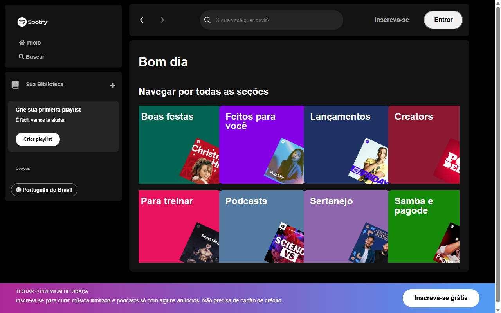

# Spotify — Imersão Front-End (Alura)


Interface inspirada no Spotify, desenvolvida durante a **Imersão Front-End da Alura** (Aula 01: revisão de HTML, CSS e JS na prática).



## Sobre

Réplica da tela inicial do Spotify — sidebar de navegação, área principal com listagem de artistas e busca — construída com **HTML, CSS e JavaScript puros**, sem frameworks. Os dados dos artistas vêm de um arquivo JSON local (`api-artists/artists.json`), simulando uma API.

## Funcionalidades

- Layout fiel à interface do Spotify (sidebar + conteúdo principal)
- Listagem de artistas carregada dinamicamente via `fetch` do JSON local
- Busca de artistas por nome
- Ícones via Font Awesome

## Estrutura

```
index.html            Estrutura da página
script.js               Carregamento e renderização dos artistas
search.js                Lógica de busca
api-artists/
  └── artists.json       Dados mockados dos artistas (simula uma API)
src/
  ├── assets/            Ícones e imagens
  └── styles/             CSS (reset, variáveis, sidebar/footer, conteúdo, responsivo)
```

## Como rodar

Não há build nem dependências — basta abrir `index.html` no navegador, ou servir a pasta com um servidor estático simples:

```bash
python -m http.server 8000
# abra http://localhost:8000
```

## Créditos

Projeto desenvolvido a partir da **Imersão Front-End** da [Alura](https://www.alura.com.br/).

## Autor

**Elton Barbosa**

- Portfólio: [eltonbarbosaa.github.io](https://eltonbarbosaa.github.io)
- GitHub: [@eltonbarbosaa](https://github.com/eltonbarbosaa)
